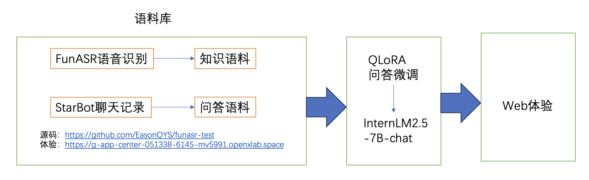

# internlmwithlove
本项目希望在InternLM2.5的基础上，可以进行模型微调，创造出可以模拟小偶像对话的聊天模型。可以通过数据抓取方法汇总数据集给大模型，大模型微调后，形成新的权重文件。通过gradio或streamlit进行网页体验开发。

教程来源参考：[https://github.com/InternLM/Tutorial](https://github.com/InternLM/Tutorial)

项目ID：1006 https://github.com/InternLM/Tutorial/discussions/1006

## 技术说明
[tech.md](tech.md)

## 技术架构

## 应用体验

数据获取：https://openxlab.org.cn/apps/detail/yisheng/ASR-funasr

模型体验：https://openxlab.org.cn/apps/detail/yisheng/steamlit-gpu

4bit量化后（目前效果较差）：https://openxlab.org.cn/apps/detail/yisheng/snh48_4bit
